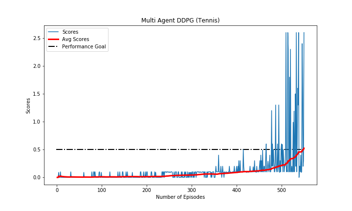

# Udacity DRLND - Collaboration and Competition

This project entails a submisison for Udacity's Deep Reinforcement Learning Nanodegree Program: Project 3 - Collaboration and Competition.


This project entails training multi agent (2) in playing table tennis by maximizing playing time, in other words avoiding the ball being out of play. 

### Table of Contents 

1. [Project Description](#description)
2. [Requirements](#requirements)
3. [Training](#training)
4. [Files](#files)
5. [Project Results](#results)
6. [Licensing and Acknowledgements](#licensing)

### Project Description<a name="description"></a>

This project entails training 2 agents to maintain a table tennis game. A reward of +0.1 is given if the agent is successfully hit the ball over the net. If an agent lets a ball hit the ground or hits the ball out of bounds, it receives a reward of -0.01 instead. Therefore the goal of these 2 agents is to keep the ball in play as long as possible. 

The following describes the Tennis environment.

1. The observation space consists of 8 variables corresponding to the position and velocity of the ball and racket
2. Each agent receives its own local observations
3. Two continuous actions are available, corresponding to movement towards or away from the net and jumping

The agents are considered to solve the environment once it attains an **average score of at least 0.5 over the past 100 consecutive episodes**. Note that this average score is computed from the accumulation of the maximum score between the two agents per episode.

### Requirements<a name="requirements"></a>

There are several requirements in order to run this project. 

- Configure Python3.6 and PyTorch environment as described in the [Udacity repository](https://github.com/udacity/deep-reinforcement-learning#dependencies).
- Install the Unity environment following the requirement [steps](https://github.com/udacity/deep-reinforcement-learning/edit/master/p3_collab-compet/README.md).
- Download the environment from one of the links below.  You need only select the environment that matches your operating system:
    - Linux: [click here](https://s3-us-west-1.amazonaws.com/udacity-drlnd/P3/Tennis/Tennis_Linux.zip)
    - Mac OSX: [click here](https://s3-us-west-1.amazonaws.com/udacity-drlnd/P3/Tennis/Tennis.app.zip)
    - Windows (32-bit): [click here](https://s3-us-west-1.amazonaws.com/udacity-drlnd/P3/Tennis/Tennis_Windows_x86.zip)
    - Windows (64-bit): [click here](https://s3-us-west-1.amazonaws.com/udacity-drlnd/P3/Tennis/Tennis_Windows_x86_64.zip)
    
    (_For Windows users_) Check out [this link](https://support.microsoft.com/en-us/help/827218/how-to-determine-whether-a-computer-is-running-a-32-bit-version-or-64) if you need help with determining if your computer is running a 32-bit version or 64-bit version of the Windows operating system.

    (_For AWS_) If you'd like to train the agent on AWS (and have not [enabled a virtual screen](https://github.com/Unity-Technologies/ml-agents/blob/master/docs/Training-on-Amazon-Web-Service.md)), then please use [this link](https://s3-us-west-1.amazonaws.com/udacity-drlnd/P3/Tennis/Tennis_Linux_NoVis.zip) to obtain the "headless" version of the environment.  You will **not** be able to watch the agent without enabling a virtual screen, but you will be able to train the agent.  (_To watch the agent, you should follow the instructions to [enable a virtual screen](https://github.com/Unity-Technologies/ml-agents/blob/master/docs/Training-on-Amazon-Web-Service.md), and then download the environment for the **Linux** operating system above._)
    
- Place the environment in the preferred path.

### Training<a name="training"></a>

The notebook Tennis.ipynb can be executed to train an agent. In training the agent, a policy based method is used. This method is called Deep Deterministic Policy Gradient (DDPG) where it implements a policy method with 2 networks, Actor and Critic. The method also implements replay buffer so that the agent can learn from random sampled experience. An implementation of normal distribution noise is also seen in this project. This is to enforce exploration (coupled with decaying noise values) within the training process of continuous control system. 

Since the environment requires two agents to be solved, a method called Multi Agent DDPG or MADDPG is implemented instead. This works similarly with DDPG, only differ in the number of agents used to solve the problem.

**Execute Tennis.ipynb to train the agent using MADDPG and execute Tennis_Demo.ipynb to test the smart agents.**

### Files<a name="files"></a>

```
- README.md
- Report.pdf # main findings, discussion and analysis
- Tennis.ipynb # main notebook to train the agents
- Tennis_Demo.ipynb # testing the saved model weights

- figures
|- maddpg_scores.png # plot of multi agent scores
|- tennis.png # environment overview

- maddpgtennis
|- __init__.py 
|- ddpg_agent.py # agent class
|- ma_ddpg.py # the multi agent class
|- model.py # network class
|- replay_buffer.py # experience replay class

- saved_model
|- agent0_DDPG_act_tennis.pth # model's weight for DDPG actor, agent number 1
|- agent0_DDPG_crit_tennis.pth # model's weight for DDPG critic, agent number 1
|- agent1_DDPG_act_tennis.pth # model's weight for DDPG actor, agent number 2
|- agent1_DDPG_crit_tennis.pth # model's weight for DDPG critic, agent number 2

```

### Project Results<a name="results"></a>

The Tennis environment with 2 agents is explored using the MADDPG method. The MADDPG method is implemented by utilizing replay buffer, normal distribution noise, as well as Actor Critic networks. The combination of this method and the environment allows the agent to finish the training process only in 550 episodes with the final average score of 0.52. 



A large number of hyperparameters combinations are explored although the configuration presented in the report is deemed to be the most optimal for the purpose of this project.

### Licensing and Acknowledgements<a name="licensing"></a>

Credits to Udacity [DRLND](https://www.udacity.com/course/deep-reinforcement-learning-nanodegree--nd893) for the sample code of DDPG for both bipedal and pendulum environments. This allows for a faster learning curve in how to implement said method to an environment which then leads to the implementation of Multi Agent DDPG (MADDPG). The environment is supported by [Unity mlagents](https://github.com/Unity-Technologies/ml-agents).
